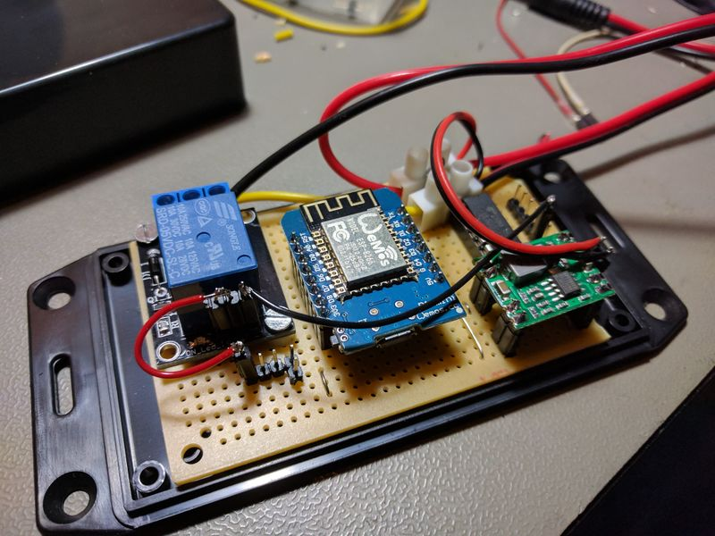

## Source code for project: [WiFi MQTT controlled relay for Home Assistant](https://www.uctrl.org/wemos-mqtt-relay/)

A single relay controlled with WiFi MQTT from Home Assistant, using a WeMos D1 mini board.

### Author
[Thomas Jensen](https://www.uctrl.org/)
